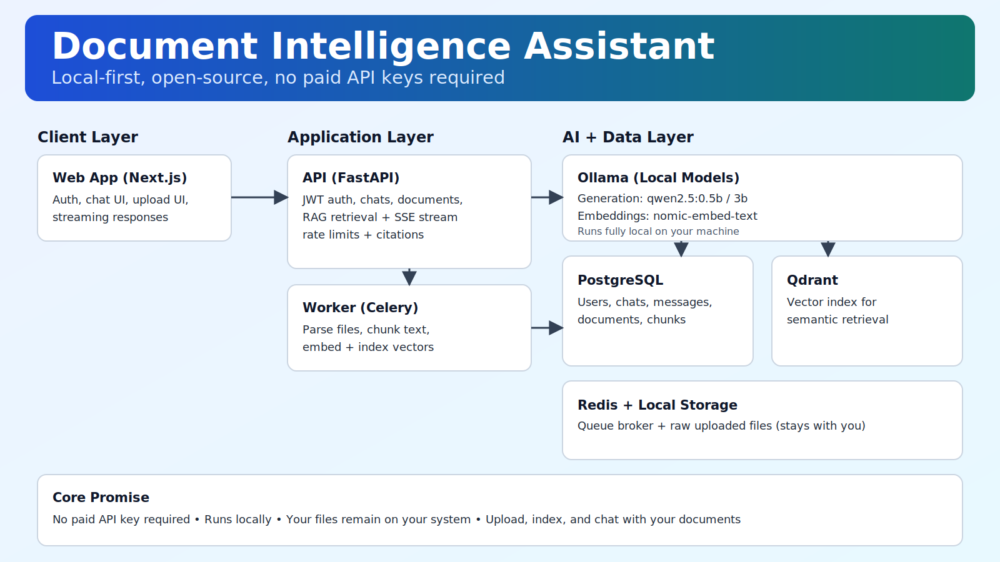

# Document Intelligence Assistant

Production-oriented, self-hosted RAG chatbot with:
- Next.js web app
- FastAPI backend
- Celery worker
- PostgreSQL + Redis + Qdrant + Ollama (+ MinIO) via Docker Compose

All core data stays local: uploaded files, chunk text, vectors, chats, and auth data.

## Architecture



- `apps/web`: chat UI, auth UI, document upload UI, streaming response UI
- `apps/api`: auth, chats, upload, retrieval, response generation, SSE stream endpoint
- `apps/worker`: async ingestion (extract text, chunk, embed, upsert to Qdrant)
- `infra/docker/docker-compose.yml`: local orchestration

## Prerequisites

- Docker Desktop (with Compose)
- Git
- Node.js 20+ and npm
- Python 3.11+ (optional for local non-docker checks)

## First-Time Setup

1. Clone repo
```powershell
git clone https://github.com/theyashmahajan/rag-chatbot.git
cd rag-chatbot
```

2. Create environment file
```powershell
Copy-Item .env.example .env
```

3. Choose a generation model in `.env` (recommended for low RAM/testing):
```env
OLLAMA_MODEL=qwen2.5:0.5b
```

4. Start services
```powershell
docker compose -f infra/docker/docker-compose.yml up --build -d
```

5. Pull required models
```powershell
docker compose -f infra/docker/docker-compose.yml exec ollama ollama pull nomic-embed-text
docker compose -f infra/docker/docker-compose.yml exec ollama ollama pull qwen2.5:0.5b
```

6. Run migrations
```powershell
docker compose -f infra/docker/docker-compose.yml exec api alembic -c /app/apps/api/alembic.ini upgrade head
```

7. Open apps
- Web UI: `http://localhost:3000`
- API docs: `http://localhost:8000/docs`

## Daily Run Commands

Start:
```powershell
docker compose -f infra/docker/docker-compose.yml up -d
```

Stop:
```powershell
docker compose -f infra/docker/docker-compose.yml down
```

Status:
```powershell
docker compose -f infra/docker/docker-compose.yml ps
```

## How to Use

1. Sign up or log in on `http://localhost:3000`
2. Create a new chat
3. Upload up to 4 files in that chat
4. Wait until file status is `indexed`
5. Ask questions about uploaded documents

## API Endpoints (Core)

- Auth:
  - `POST /auth/signup`
  - `POST /auth/login`
  - `POST /auth/refresh`
  - `GET /auth/me`
- Chats:
  - `POST /chats`
  - `GET /chats`
  - `GET /chats/{chat_id}`
  - `DELETE /chats/{chat_id}`
- Documents:
  - `POST /chats/{chat_id}/documents`
  - `GET /chats/{chat_id}/documents`
- Messages:
  - `POST /chats/{chat_id}/messages`
  - `POST /chats/{chat_id}/messages/stream`
  - `GET /chats/{chat_id}/messages`

## Common Problems and Fixes

### 1) `Client error 404 for /api/generate`
Cause: configured generation model is not pulled in Ollama.

Fix:
```powershell
docker compose -f infra/docker/docker-compose.yml exec ollama ollama list
docker compose -f infra/docker/docker-compose.yml exec ollama ollama pull qwen2.5:0.5b
```
Set `.env`:
```env
OLLAMA_MODEL=qwen2.5:0.5b
```
Then:
```powershell
docker compose -f infra/docker/docker-compose.yml restart api worker
```

### 2) Document shows `failed`
Cause: ingestion/indexing issue in worker.

Check:
```powershell
docker compose -f infra/docker/docker-compose.yml logs --tail 200 worker
```
Then create a new chat and re-upload.

### 3) `No relevant indexed context found`
Cause: asking before indexing completed, or file indexed in a different chat.

Fix:
- ensure document status is `indexed` in current chat
- ask in the same chat where file was uploaded

### 4) Web delete chat throws JSON parse error (fixed)
The API helper now handles empty `204 No Content` responses safely.

## Logs

```powershell
docker compose -f infra/docker/docker-compose.yml logs -f api
docker compose -f infra/docker/docker-compose.yml logs -f worker
docker compose -f infra/docker/docker-compose.yml logs -f web
docker compose -f infra/docker/docker-compose.yml logs -f ollama
```
